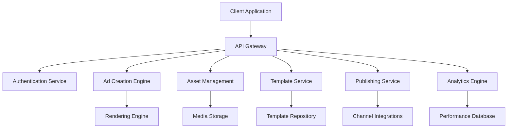
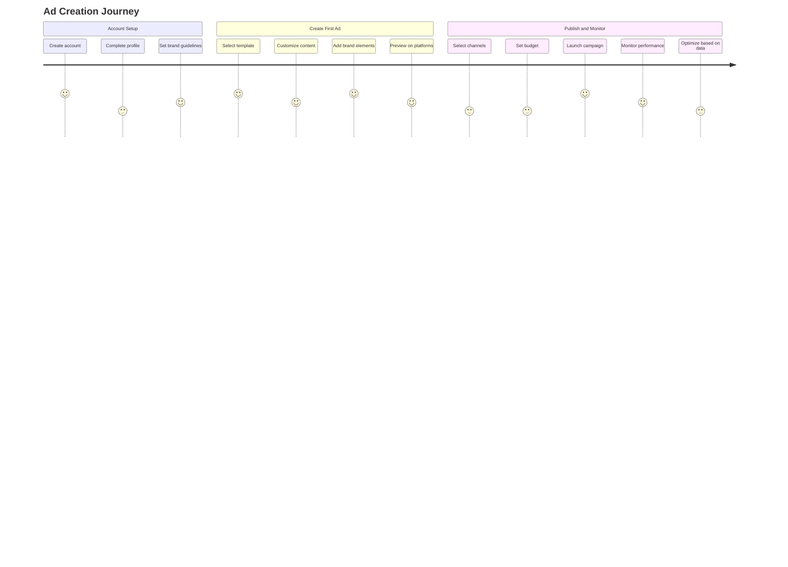
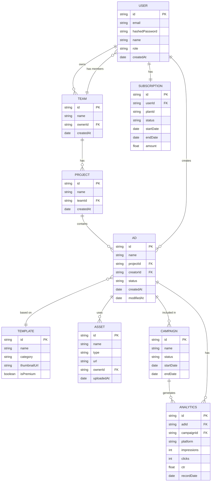
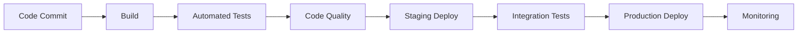

# AdCraft: Advanced Ad Creation Platform

## 1. Project Overview
- **Brief Description**: AdCraft is a comprehensive platform designed to streamline the creation, management, and optimization of digital advertisements across multiple formats and channels.
- **Core Vision**: To democratize high-quality ad creation by providing intuitive tools that blend creativity with data-driven insights.
- **Mission**: Enable businesses of all sizes to create compelling, effective advertisements without requiring specialized design or technical skills.
- **Target Audience**:
  - Small to medium-sized businesses
  - Marketing teams in larger organizations
  - Creative agencies
  - Freelance marketers and content creators
- **Value Proposition**: Reduce time-to-market for ad campaigns, improve ad performance through data-driven design, and enable rapid iteration with minimal resource investment.

## 2. System Architecture

### High-Level Architecture


### Key Components
1. **Client Application**: React-based front-end with responsive design
2. **API Gateway**: Manages API requests, authentication, and routing
3. **Authentication Service**: Handles user registration, login, and permissions
4. **Ad Creation Engine**: Core component for ad design and editing
5. **Asset Management**: Handles uploading, storage, and retrieval of media assets
6. **Template Service**: Manages reusable ad templates and components
7. **Publishing Service**: Facilitates ad distribution to various platforms
8. **Analytics Engine**: Collects and processes ad performance data
9. **Rendering Engine**: Generates final ad outputs in various formats
10. **Media Storage**: Cloud-based storage for images, videos, and audio files
11. **Template Repository**: Database of ad templates categorized by industry, goal, etc.
12. **Channel Integrations**: Connectors for social media, display networks, etc.
13. **Performance Database**: Stores analytics data for reporting and optimization

### Technology Stack
- **Frontend**: React v18, TypeScript, Material-UI v5
- **Backend**: Node.js, NestJS for microservices
- **Database**: MongoDB (main data), PostgreSQL (analytics)
- **Media Processing**: FFmpeg, Sharp
- **Authentication**: JWT, OAuth2
- **Cloud Services**: AWS (S3 for storage, Lambda for processing)
- **DevOps**: Docker, Kubernetes, CI/CD with GitHub Actions
- **Monitoring**: Prometheus, Grafana
- **Analytics**: Custom analytics engine with ML-based insights
- **Mobile**: React Native / Expo for mobile applications
- **Payment Processing**: Stripe for subscription management

## 3. Functional Requirements

### User Management
- User registration and authentication
- Role-based access control (Admin, Editor, Viewer)
- Team management and collaboration features
- User preferences and settings

### Ad Creation
- Drag-and-drop ad builder interface
- Text editing with typography controls
- Image and video import, cropping, and basic editing
- Animation and transition effects
- Smart layout suggestions
- Brand asset management (logos, colors, fonts)
- Multi-format support (display ads, social media posts, video ads)
- Responsive design tools for multiple dimensions

### Template System
- Pre-designed professional templates
- Industry-specific template collections
- Custom template creation and saving
- Template sharing within teams
- Version control for templates

### Asset Management
- Upload and organize media assets (images, videos, audio)
- Asset tagging and search functionality
- Usage tracking for assets
- Licensing and rights management
- Integration with stock media providers

### Preview and Rendering
- Real-time preview of ad designs
- Platform-specific previews (how ads will look on different channels)
- High-quality rendering for final production
- Format conversion for different platforms
- Optimization for file size and loading speed

### Publishing and Distribution
- Direct publishing to ad platforms (Google Ads, Facebook, etc.)
- Scheduling and campaign management
- A/B testing capabilities
- Multi-channel campaign coordination
- Approval workflows for team collaboration

### Analytics
- Performance tracking across channels
- Engagement metrics and visualization
- A/B test result analysis
- ROI calculation tools
- Automated performance reports
- Optimization suggestions based on performance data

### Monetization
- Subscription-based pricing tiers
- Premium templates and features
- Usage-based billing options
- Payment processing and invoice management
- Free trial and freemium model

## 4. Non-Functional Requirements

### Performance
- Page load time < 2 seconds
- Design operations respond within 200ms
- Rendering completion < 30 seconds for complex ads
- Support for concurrent users (initially 1000+)
- Efficient handling of large media assets

### Scalability
- Horizontal scaling for increased user load
- Cloud-based infrastructure for elastic capacity
- Microservices architecture for component scaling
- CDN integration for global content delivery
- Database sharding strategy for growth

### Security
- End-to-end encryption for data transmission
- Secure asset storage with access controls
- Regular security audits and penetration testing
- GDPR and CCPA compliance measures
- API rate limiting and abuse prevention
- Secure authentication with MFA option

### Reliability
- 99.9% uptime SLA
- Automated backup and recovery procedures
- Graceful degradation during partial outages
- Comprehensive error logging and monitoring
- Fault tolerance in distributed components

### Accessibility
- WCAG 2.1 AA compliance
- Screen reader compatibility
- Keyboard navigation support
- Color contrast considerations
- Internationalization and localization support

## 5. User Experience Design

### User Personas
1. **Marketing Manager (Maria)**
   - Oversees ad campaigns but doesn't create ads personally
   - Needs approval workflows and performance metrics
   - Values team collaboration features

2. **SMB Owner (Sam)**
   - Limited marketing budget and expertise
   - Needs intuitive tools and templates
   - Values quick results and ROI tracking

3. **Creative Designer (Carlos)**
   - Professional with design expertise
   - Needs advanced customization options
   - Values creative control and high-quality output

4. **Digital Marketing Specialist (Diana)**
   - Creates and manages multiple campaigns
   - Needs multi-channel publishing and analytics
   - Values efficiency and data-driven optimization

### User Journeys


### Key Screens
1. Dashboard
2. Template Gallery
3. Ad Editor
4. Asset Library
5. Campaign Manager
6. Analytics Dashboard
7. Team Collaboration Space
8. Settings and Account Management

## 6. Database Design

### Entity Relationship Diagram


### Data Models

#### User Model
```json
{
  "id": "unique_id",
  "email": "user@example.com",
  "hashedPassword": "hashed_string",
  "name": "User Name",
  "role": "admin|editor|viewer",
  "teams": ["team_id_1", "team_id_2"],
  "preferences": {
    "theme": "light|dark",
    "notifications": true|false
  },
  "createdAt": "timestamp",
  "lastLogin": "timestamp"
}
```

#### Ad Model
```json
{
  "id": "unique_id",
  "name": "Ad Name",
  "projectId": "project_id",
  "creatorId": "user_id",
  "templateId": "template_id",
  "status": "draft|review|approved|published",
  "dimensions": {
    "width": 1200,
    "height": 628
  },
  "content": {
    "elements": [
      {
        "id": "elem_1",
        "type": "text|image|video|shape",
        "properties": {},
        "position": {},
        "style": {}
      }
    ],
    "background": {}
  },
  "assets": ["asset_id_1", "asset_id_2"],
  "versions": ["version_id_1", "version_id_2"],
  "createdAt": "timestamp",
  "modifiedAt": "timestamp"
}
```

#### Subscription Model
```json
{
  "id": "unique_id",
  "userId": "user_id",
  "planId": "plan_id",
  "status": "active|cancelled|past_due",
  "startDate": "timestamp",
  "endDate": "timestamp",
  "amount": 29.99,
  "interval": "month|year",
  "features": ["premium_templates", "team_collaboration", "advanced_analytics"],
  "paymentMethod": {
    "type": "card|paypal",
    "last4": "1234",
    "expiryDate": "MM/YY"
  }
}
```

## 7. API Specifications

### RESTful Endpoints

#### Authentication
- `POST /api/auth/register` - Create new user account
- `POST /api/auth/login` - Authenticate user
- `POST /api/auth/refresh` - Refresh access token
- `POST /api/auth/logout` - Logout user

#### Users
- `GET /api/users/me` - Get current user info
- `PUT /api/users/me` - Update current user
- `GET /api/users/{id}` - Get user by ID
- `PUT /api/users/{id}` - Update user by ID (admin)

#### Teams
- `GET /api/teams` - List user's teams
- `POST /api/teams` - Create new team
- `GET /api/teams/{id}` - Get team details
- `PUT /api/teams/{id}` - Update team
- `DELETE /api/teams/{id}` - Delete team
- `POST /api/teams/{id}/members` - Add team member
- `DELETE /api/teams/{id}/members/{userId}` - Remove team member

#### Projects
- `GET /api/projects` - List projects
- `POST /api/projects` - Create new project
- `GET /api/projects/{id}` - Get project details
- `PUT /api/projects/{id}` - Update project
- `DELETE /api/projects/{id}` - Delete project

#### Ads
- `GET /api/ads` - List ads
- `POST /api/ads` - Create new ad
- `GET /api/ads/{id}` - Get ad details
- `PUT /api/ads/{id}` - Update ad
- `DELETE /api/ads/{id}` - Delete ad
- `POST /api/ads/{id}/duplicate` - Duplicate ad
- `POST /api/ads/{id}/render` - Render ad
- `POST /api/ads/{id}/publish` - Publish ad

#### Templates
- `GET /api/templates` - List templates
- `POST /api/templates` - Create custom template
- `GET /api/templates/{id}` - Get template details
- `PUT /api/templates/{id}` - Update template
- `DELETE /api/templates/{id}` - Delete template

#### Assets
- `GET /api/assets` - List assets
- `POST /api/assets` - Upload new asset
- `GET /api/assets/{id}` - Get asset details
- `DELETE /api/assets/{id}` - Delete asset

#### Campaigns
- `GET /api/campaigns` - List campaigns
- `POST /api/campaigns` - Create campaign
- `GET /api/campaigns/{id}` - Get campaign details
- `PUT /api/campaigns/{id}` - Update campaign
- `DELETE /api/campaigns/{id}` - Delete campaign
- `GET /api/campaigns/{id}/analytics` - Get campaign analytics

#### Analytics
- `GET /api/analytics/ads/{id}` - Get ad performance
- `GET /api/analytics/campaigns/{id}` - Get campaign performance
- `GET /api/analytics/dashboard` - Get analytics dashboard data

#### Subscriptions
- `GET /api/subscriptions` - Get current subscription
- `POST /api/subscriptions` - Create new subscription
- `PUT /api/subscriptions/{id}` - Update subscription
- `DELETE /api/subscriptions/{id}` - Cancel subscription
- `GET /api/subscription-plans` - List available plans

### Authentication Mechanism
- JWT-based authentication
- Tokens: Access (short-lived) and Refresh (long-lived)
- API Key authentication for integrations

### Rate Limiting
- Authenticated endpoints: 100 requests per minute
- Authentication endpoints: 10 requests per minute
- Asset upload: 50 uploads per hour
- Rendering endpoints: 20 requests per hour

## 8. Implementation Plan

### Development Phases and Sprints

#### Phase 1: Foundation & Core Architecture (Weeks 1-4)

**Sprint 1.1: Project Setup & CI/CD (Week 1)**
- Initialize monorepo using NX
- Configure Docker containerization for microservices
- Set up GitHub Actions for CI/CD pipeline
- Configure development, staging, and production environments
- Create basic project documentation

**Sprint 1.2: Authentication & User Management (Weeks 2-3)**
- Implement JWT/OAuth2 authentication service
- Build user registration and login flows
- Create user profile management
- Implement role-based access control
- Set up MongoDB and basic data models

**Sprint 1.3: API Gateway & Service Foundation (Week 4)**
- Set up API Gateway with Express.js
- Implement initial microservice architecture
- Configure inter-service communication
- Establish basic logging and monitoring
- Deploy infrastructure as code with Terraform

**Deliverables:**
- Working development environment with CI/CD pipeline
- Authentication service with user management
- Basic microservice architecture
- Infrastructure as code foundation

#### Phase 2: Core Features Development (Weeks 5-10)

**Sprint 2.1: Asset Management (Week 5)**
- Implement S3 integration for media storage
- Create asset upload service and endpoints
- Build asset library user interface
- Implement asset tagging and search
- Add basic image processing capabilities

**Sprint 2.2: Ad Editor Foundation (Weeks 6-7)**
- Integrate canvas-based editor (Fabric.js)
- Implement basic shape and text editing
- Create layer management system
- Build property panel and editing tools
- Add image import and manipulation features

**Sprint 2.3: Template System (Weeks 8-9)**
- Design template data schema
- Implement template creation and management
- Create template gallery UI
- Add template categorization and search
- Implement template application to canvas

**Sprint 2.4: Basic Dashboard & Preview (Week 10)**
- Build user dashboard interface
- Implement project management
- Create ad preview functionality
- Implement responsive design testing
- Add basic export capabilities

**Deliverables:**
- Functional asset management system
- Basic ad editor with essential editing capabilities
- Template system with gallery
- User dashboard and preview functionality

#### Phase 3: Advanced Features (Weeks 11-16)

**Sprint 3.1: Advanced Editing Tools (Weeks 11-12)**
- Implement advanced text formatting
- Add layer effects and filters
- Create animation and transition tools
- Implement smart alignment and distribution
- Add brand asset management

**Sprint 3.2: Publishing System (Weeks 13-14)**
- Build publishing service
- Implement platform-specific formatters
- Create campaign management interface
- Add scheduling capabilities
- Implement basic approval workflows

**Sprint 3.3: Team Collaboration (Weeks 15-16)**
- Implement team management functionality
- Create shared workspace features
- Add real-time collaboration tools
- Implement version history and comparison
- Create commenting and feedback system

**Deliverables:**
- Advanced editing capabilities
- Multi-platform publishing system
- Team collaboration features
- Version control and history

#### Phase 4: Analytics & Monetization (Weeks 17-20)

**Sprint 4.1: Analytics Implementation (Weeks 17-18)**
- Set up PostgreSQL analytics database
- Build data collection endpoints
- Implement ETL processes
- Create analytics dashboard
- Add custom report generation

**Sprint 4.2: A/B Testing & Optimization (Week 19)**
- Implement A/B testing framework
- Create experiment management UI
- Add statistical analysis tools
- Build recommendation engine
- Implement performance optimization

**Sprint 4.3: Monetization (Week 20)**
- Integrate Stripe for payment processing
- Implement subscription management
- Create tiered feature access
- Build billing dashboard
- Add usage tracking and limits

**Deliverables:**
- Comprehensive analytics system
- A/B testing framework
- Performance optimization tools
- Subscription and billing system

#### Phase 5: Mobile & Refinement (Weeks 21-24)

**Sprint 5.1: Mobile App Development (Weeks 21-22)**
- Set up React Native/Expo project
- Create mobile-specific UI components
- Implement core functionality for mobile
- Add offline capabilities
- Ensure cross-platform consistency

**Sprint 5.2: QA & Testing (Week 23)**
- Implement end-to-end testing with Cypress
- Conduct performance testing and optimization
- Complete accessibility audit
- Perform security testing
- Fix identified issues

**Sprint 5.3: Launch Preparation (Week 24)**
- Finalize documentation
- Create user guides and tutorials
- Prepare marketing materials
- Set up support infrastructure
- Conduct final review and approval

**Deliverables:**
- Mobile application for iOS and Android
- Comprehensive testing and QA
- Complete documentation
- Launch-ready platform

#### Phase 6: Beta & Production Launch (Weeks 25-28)

**Sprint 6.1: Beta Release (Weeks 25-26)**
- Launch beta program
- Collect and analyze user feedback
- Implement critical improvements
- Fix high-priority issues
- Finalize scaling plan

**Sprint 6.2: Production Launch (Weeks 27-28)**
- Complete production deployment
- Activate all integrations
- Implement monitoring and alerting
- Establish support processes
- Begin marketing and user acquisition

**Deliverables:**
- Fully functional production environment
- Active user base
- Operational support infrastructure
- Marketing and user acquisition plan

### Resource Allocation
- 2 Frontend Developers
- 2 Backend Developers
- 1 DevOps Engineer
- 1 UI/UX Designer
- 1 QA Specialist
- 1 Product Manager

### Milestones
1. **Architecture Ready** (Week 4)
   - Core infrastructure deployed
   - Authentication service operational
   - Microservices foundation established

2. **MVP Release** (Week 10)
   - Basic ad creation functionality
   - Core template system
   - Asset management
   - User dashboard

3. **Advanced Features Complete** (Week 16)
   - Advanced editing capabilities
   - Publishing integrations
   - Team collaboration
   - Version control

4. **Beta Launch** (Week 20)
   - Analytics and A/B testing
   - Monetization implemented
   - Complete feature set
   - Performance optimized

5. **Mobile Release** (Week 24)
   - Mobile applications available
   - Cross-platform functionality
   - Offline capabilities
   - Syncing between devices

6. **Production Launch** (Week 28)
   - Full platform availability
   - All integrations active
   - Support infrastructure operational
   - Marketing campaign active

## 9. Testing Strategy

### Testing Levels
- **Unit Testing**: Individual components and functions
- **Integration Testing**: API endpoints and service interactions
- **System Testing**: End-to-end workflows
- **Performance Testing**: Load and stress testing
- **Usability Testing**: User experience evaluation
- **Security Testing**: Vulnerability assessment
- **Mobile Testing**: Device and platform compatibility

### Testing Environments
- **Development**: Local testing during development
- **Staging**: Pre-production environment for integration testing
- **Beta**: Limited production access for real-world testing
- **Production**: Monitoring and smoke tests

### Automation Strategy
- Automated unit tests with Jest
- API testing with Postman/Newman
- UI testing with Cypress
- Performance testing with k6
- Mobile testing with Detox
- CI/CD pipeline integration for test automation
- Daily automated test runs

### Quality Metrics
- Test coverage > 80%
- Max 5 critical bugs in production
- Performance benchmarks met
- Accessibility compliance verified
- Zero high-severity security vulnerabilities

## 10. Deployment and DevOps

### CI/CD Pipeline


### Infrastructure (AWS-based)
- ECS/EKS for containerized microservices
- S3 for asset storage
- CloudFront for content delivery
- RDS for PostgreSQL analytics database
- DocumentDB for MongoDB document storage
- Lambda for serverless functions
- ElastiCache for caching
- CloudWatch for monitoring and alerting
- Route53 for DNS management
- WAF for security protection

### Environments
- Development (for daily development work)
- Staging (for pre-release testing)
- Beta (for user acceptance testing)
- Production (for end-users)

### Monitoring and Alerting
- Application performance monitoring with New Relic
- Error tracking with Sentry
- Resource utilization metrics with Prometheus
- User experience monitoring with LogRocket
- On-call rotation with PagerDuty
- Custom dashboards with Grafana

## 11. Maintenance and Support

### Support Levels
- **Tier 1**: Basic user assistance via chatbot and knowledge base
- **Tier 2**: Technical issue resolution by support engineers
- **Tier 3**: Advanced problem investigation by development team

### Update Strategy
- Bi-weekly feature updates
- Monthly maintenance releases
- Quarterly major version updates
- Hotfixes as needed for critical issues
- Automated deployment with rollback capability

### Documentation
- User guides and tutorials
- API documentation with Swagger/OpenAPI
- Administrator documentation
- Developer documentation
- Video tutorials and webinars

## 12. Project Risks and Mitigation

### Identified Risks
1. **Technical Complexity**
   - Risk: Advanced features like real-time collaboration prove difficult
   - Mitigation: Incremental implementation, technical spikes, expert consultation

2. **Integration Challenges**
   - Risk: Third-party platform APIs change or limit access
   - Mitigation: Abstraction layer, fallback mechanisms, regular compatibility testing

3. **Performance Issues**
   - Risk: System becomes slow with many assets or complex ads
   - Mitigation: Performance testing, optimization sprints, caching strategies

4. **Market Adoption**
   - Risk: Target users find interface too complex or lacking features
   - Mitigation: Early user testing, phased rollout, feedback incorporation

5. **Resource Constraints**
   - Risk: Development team stretched across too many features
   - Mitigation: Clear prioritization, MVP focus, agile methodology

6. **Security Vulnerabilities**
   - Risk: User data or assets compromised
   - Mitigation: Regular security audits, penetration testing, automated scanning

### Contingency Plans
- Feature scope reduction if timelines are threatened
- Additional resources allocation for critical path delays
- Phased rollout to manage scale and address issues incrementally
- Regular risk reassessment during sprint reviews
- Fallback options for critical functionalities