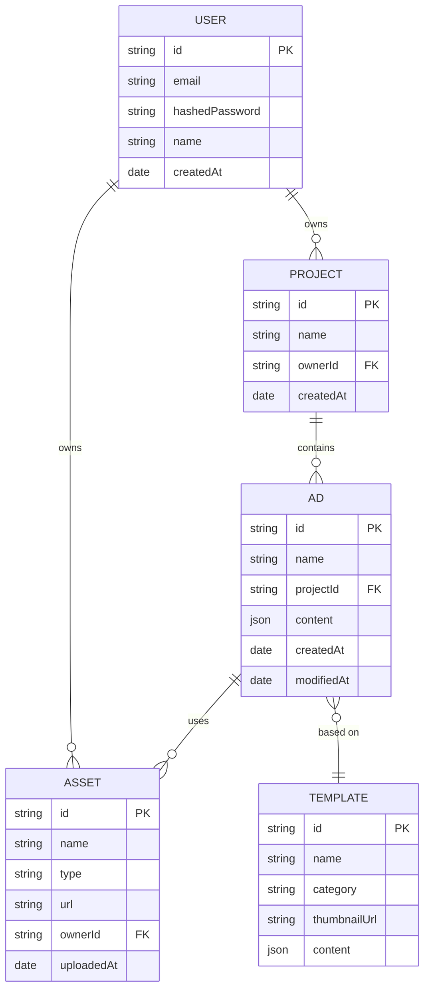
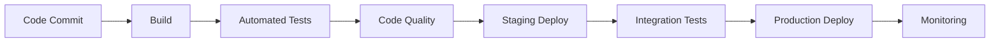

# AdCraft v2 - Technical Architecture (MVP)

This document outlines the revised technical architecture for the AdCraft platform restart. The focus is on a minimal, viable, and stable core that can be built upon.

## System Architecture Overview (MVP)

```mermaid
graph TD
    A[Client Application] --> B[API Gateway]
    B --> C[Authentication Service]
    B --> D[Ad Service]
    B --> E[Asset Service]
    B --> F[Template Service]
    E --> G[Media Storage (S3)]
```

## Microservices Architecture Detail

### Authentication Service

**Responsibility**: Manages user authentication, registration, and authorization.

**Key Components**:

- User management
- JWT token generation and validation
- Role-based access control
- Social login integration
- Password recovery

**Database**: PostgreSQL (user profiles, credentials, roles)

**APIs**:

- POST /auth/register - Register new user
- POST /auth/login - Authenticate user
- POST /auth/refresh - Refresh access token
- GET /auth/profile - Get user profile
- PUT /auth/profile - Update user profile

### Asset Service

**Responsibility**: Handles asset upload, storage, and management.

**Key Components**:

- File upload processing
- Image optimization
- Asset metadata management
- Asset categorization
- S3 integration

**Database**: MongoDB (asset metadata), S3 (asset storage)

**APIs**:

- POST /assets - Upload new asset
- GET /assets - List assets
- GET /assets/:id - Get asset details
- PUT /assets/:id - Update asset metadata
- DELETE /assets/:id - Delete asset

### Template Service

**Responsibility**: Manages ad templates and template categories.

**Key Components**:

- Template CRUD operations
- Template categorization
- Template search and filtering
- Template versioning

**Database**: MongoDB (templates, categories)

**APIs**:

- POST /templates - Create template
- GET /templates - List templates
- GET /templates/:id - Get template details
- PUT /templates/:id - Update template
- DELETE /templates/:id - Delete template
- GET /categories - List template categories

### Ad Creation Service

**Responsibility**: Handles ad creation, editing, and storage.

**Key Components**:

- Ad CRUD operations
- Ad content storage
- Ad versioning
- Project management

**Database**: MongoDB (ads, projects, versions)

**APIs**:

- POST /ads - Create ad
- GET /ads - List ads
- GET /ads/:id - Get ad details
- PUT /ads/:id - Update ad
- DELETE /ads/:id - Delete ad
- POST /ads/:id/duplicate - Duplicate ad
- POST /ads/:id/versions - Create version
- GET /ads/:id/versions - List versions

## Database Schema Design

### Entity Relationship Diagram (MVP)



### Database Schemas

The authentication service uses **PostgreSQL** while other services continue to rely on MongoDB.

#### Users Table (PostgreSQL)

```sql
CREATE TABLE users (
  id SERIAL PRIMARY KEY,
  email VARCHAR(255) UNIQUE NOT NULL,
  password_hash VARCHAR(255) NOT NULL,
  name VARCHAR(255),
  role VARCHAR(50) DEFAULT 'user',
  created_at TIMESTAMP DEFAULT CURRENT_TIMESTAMP,
  updated_at TIMESTAMP DEFAULT CURRENT_TIMESTAMP
);
```

#### Assets Collection

```
{
  _id: ObjectId,
  name: String,
  type: String,
  url: String,
  key: String,
  ownerId: ObjectId,
  size: Number,
  tags: [String],
  metadata: Object,
  createdAt: Date,
  updatedAt: Date
}
```

#### Templates Collection

```
{
  _id: ObjectId,
  name: String,
  category: String,
  thumbnailUrl: String,
  isPremium: Boolean,
  dimensions: {
    width: Number,
    height: Number
  },
  content: {
    elements: [
      {
        id: String,
        type: String,
        properties: Object,
        position: Object,
        style: Object
      }
    ],
    background: Object
  },
  tags: [String],
  creatorId: ObjectId,
  isPublic: Boolean,
  createdAt: Date,
  updatedAt: Date
}
```

#### Ads Collection

```
{
  _id: ObjectId,
  name: String,
  projectId: ObjectId,
  ownerId: ObjectId,
  templateId: ObjectId,
  dimensions: {
    width: Number,
    height: Number
  },
  content: {
    elements: [
      {
        id: String,
        type: String,
        properties: Object,
        position: Object,
        style: Object
      }
    ],
    background: Object
  },
  thumbnailUrl: String,
  versions: [
    {
      versionId: String,
      createdAt: Date,
      content: Object
    }
  ],
  createdAt: Date,
  updatedAt: Date
}
```

#### Projects Collection

```
{
  _id: ObjectId,
  name: String,
  description: String,
  ownerId: ObjectId,
  teamId: ObjectId,
  adCount: Number,
  createdAt: Date,
  updatedAt: Date
}
```

## Frontend Architecture

The frontend application is built using React with the following architecture:

```
┌──────────────────────────────────────────────────────────────────────┐
│                        Application Shell                              │
│                                                                      │
│  ┌──────────────┐  ┌──────────────┐  ┌──────────────┐  ┌───────────┐ │
│  │    Router    │  │    Redux     │  │    Theme     │  │  Service  │ │
│  │              │  │    Store     │  │   Provider   │  │  Workers  │ │
│  └──────────────┘  └──────────────┘  └──────────────┘  └───────────┘ │
│                                                                      │
└──────────────────────────────────────────────────────────────────────┘
                                │
                ┌───────────────┼───────────────┐
                │               │               │
                ▼               ▼               ▼
┌───────────────────┐  ┌────────────────┐  ┌───────────────────┐
│   Feature Pages   │  │  Core Layouts  │  │ Shared Components │
│                   │  │                │  │                   │
│ ┌───────────────┐ │  │ ┌────────────┐ │  │ ┌───────────────┐ │
│ │   Dashboard   │ │  │ │   Header   │ │  │ │    Buttons    │ │
│ └───────────────┘ │  │ └────────────┘ │  │ └───────────────┘ │
│                   │  │                │  │                   │
│ ┌───────────────┐ │  │ ┌────────────┐ │  │ ┌───────────────┐ │
│ │  Ad Editor    │ │  │ │  Sidebar   │ │  │ │     Forms     │ │
│ └───────────────┘ │  │ └────────────┘ │  │ └───────────────┘ │
│                   │  │                │  │                   │
│ ┌───────────────┐ │  │ ┌────────────┐ │  │ ┌───────────────┐ │
│ │ Asset Library │ │  │ │   Footer   │ │  │ │    Modals     │ │
│ └───────────────┘ │  │ └────────────┘ │  │ └───────────────┘ │
│                   │  │                │  │                   │
└───────────────────┘  └────────────────┘  └───────────────────┘
        │                      │                    │
        └──────────────────────┼────────────────────┘
                               │
                               ▼
┌───────────────────────────────────────────────────────────────────┐
│                     Services & State Management                    │
│                                                                   │
│  ┌──────────────┐   ┌──────────────┐   ┌──────────────────────┐   │
│  │ API Services │   │ Redux Slices │   │ Custom React Hooks   │   │
│  └──────────────┘   └──────────────┘   └──────────────────────┘   │
│                                                                   │
└───────────────────────────────────────────────────────────────────┘
```

### Key Frontend Components

#### Ad Editor

The ad editor is built using Fabric.js and consists of several components:

```
┌─────────────────────────────────────────────────────────────────┐
│                           Ad Editor                             │
│                                                                 │
│  ┌─────────────┐  ┌─────────────────────────┐  ┌─────────────┐  │
│  │             │  │                         │  │             │  │
│  │             │  │                         │  │             │  │
│  │             │  │                         │  │             │  │
│  │   Layers    │  │      Canvas Area        │  │ Properties  │  │
│  │   Panel     │  │                         │  │   Panel     │  │
│  │             │  │                         │  │             │  │
│  │             │  │                         │  │             │  │
│  │             │  │                         │  │             │  │
│  └─────────────┘  └─────────────────────────┘  └─────────────┘  │
│                                                                 │
│  ┌─────────────────────────────────────────────────────────────┐│
│  │                       Toolbar                               ││
│  └─────────────────────────────────────────────────────────────┘│
└─────────────────────────────────────────────────────────────────┘
```

## Infrastructure and Deployment (MVP)

The AdCraft platform will be deployed on AWS using Docker Compose for initial development and will be designed for a future migration to Kubernetes.

```mermaid
graph TD
    subgraph AWS
        subgraph "VPC"
            subgraph "Public Subnet"
                A[Application Load Balancer]
            end
            subgraph "Private Subnet"
                B[EC2 Instance (Docker)]
                C[RDS (PostgreSQL)]
                D[ElastiCache (Redis)]
            end
        end
        E[S3 for Media Storage]
    end

    A --> B
    B --> C
    B --> D
    B --> E
```

## Deployment Strategy

The deployment strategy uses a CI/CD pipeline with the following workflow:



1. **Build Pipeline**:

   - Code is pushed to GitHub
   - GitHub Actions trigger automated tests
   - Docker images are built and tagged with Git SHA
   - Images are pushed to ECR

2. **Staging Deployment**:

   - Images are deployed to staging EKS cluster
   - Integration tests are run
   - Manual approval for production deployment

3. **Production Deployment**:
   - Blue/Green deployment strategy
   - Terraform applies infrastructure changes
   - New version is deployed to green environment
   - Traffic is gradually shifted from blue to green
   - Rollback capability if issues are detected

## Integration Points

### Third-Party Service Integrations

1. **Authentication Providers**:

   - Google OAuth
   - Facebook Login
   - Apple ID

2. **Payment Processing**:

   - Stripe for subscription management
   - PayPal for alternative payment method

3. **Ad Platforms**:

   - Facebook Ads API
   - Google Ads API
   - LinkedIn Ads API
   - Twitter Ads API
   - TikTok Ads API

4. **Analytics Providers**:

   - Google Analytics
   - Mixpanel
   - HotJar

5. **Email Services**:
   - Amazon SES
   - SendGrid

## Scalability Considerations

The architecture is designed for horizontal scalability with the following considerations:

1. **Stateless Services**:

   - All microservices are designed to be stateless
   - Session state is stored in Redis
   - Authentication uses JWT tokens

2. **Database Scaling**:

  - MongoDB sharding for document stores
  - PostgreSQL replication for the authentication service and analytics
  - Connection pooling

3. **Caching Strategy**:

   - Redis for application caching
   - CloudFront for CDN caching
   - In-memory caching for frequent operations

4. **Auto-Scaling**:
   - EKS node auto-scaling based on CPU/memory
   - Service-level scaling based on custom metrics
   - Database connection auto-scaling

## Security Considerations

1. **Authentication & Authorization**:

   - JWT tokens with short expiration
   - Refresh token rotation
   - Role-based access control
   - API Gateway authentication

2. **Data Protection**:

   - Encryption at rest for all data stores
   - TLS for all communications
   - API request validation

3. **Network Security**:

   - VPC with private subnets
   - Security groups limiting access
   - WAF for API Gateway
   - Regular vulnerability scanning

4. **Compliance**:
   - GDPR compliance for user data
   - CCPA provisions
   - Audit logging for sensitive operations

## Monitoring and Observability

1. **Logging**:

   - Centralized logging with CloudWatch Logs
   - Structured logging format
   - Log retention policies

2. **Metrics**:

   - Custom application metrics
   - Infrastructure metrics
   - Business metrics

3. **Tracing**:

   - Distributed tracing with X-Ray
   - Request ID propagation
   - Service dependency mapping

4. **Alerting**:
   - CloudWatch Alarms
   - PagerDuty integration
   - Slack notifications

## Disaster Recovery

1. **Backup Strategy**:

   - Daily database backups
   - Cross-region replication for S3
   - Configuration backups with Terraform state

2. **Recovery Plans**:

   - RTO (Recovery Time Objective): 1 hour
   - RPO (Recovery Point Objective): 15 minutes
   - Documented recovery procedures

3. **Failover Mechanisms**:
   - Multi-AZ deployments
   - Database failover testing
   - Regular DR drills
